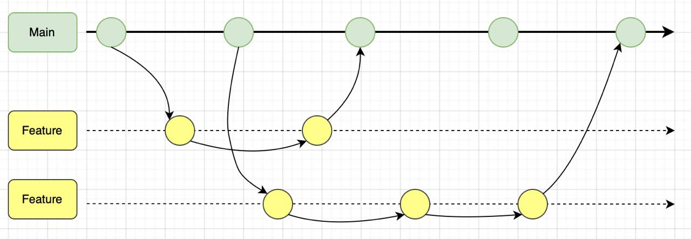

# Obligatorio DevOps 2024
## Grupo: Santiago Arzuaga - Matias Corbalan

### Presentacion del problema:

Una empresa presentó problemas en la comprension y comunicacion entre los equipos de desarrollo y operaciones. Este problema se vio evidenciado al momento de entregar su producto al mercado, donde, a pesar de utilizar las ultimas herramientas y tecnologias, se presentaron errores e inconvenientes inesperados, afectando tanto a la empresa, como a sus usuarios.

Era evidente que la causa del problema no era tecnica, sino cultural y organizativa, donde el equipo de desarrollo y operaciones no se comunicaban eficientemente, y cada equipo velaba por sus tareas y responsabilidades por separado.

Para resolverlo, la empresa identificó la necesidad de un cambio cultural profundo que fomentara la colaboración, la transparencia y la alineación de objetivos entre los equipos, superando así los desafíos actuales y estableciendo las bases para operaciones más ágiles y resilientes a futuro.

### Solucion presentada:

Para abordar los desafíos identificados, se implementó un plan que transformó la forma en que los equipos de desarrollo y operaciones colaboran, centrándose en la adopción de ciclos de integración y despliegue continuo (CI/CD), y el uso de tecnologías como Docker, GitHub Actions, AWS Fargate, VPC y Amazon Elastic Container Registry (ECR) para facilitar el flujo desde que un desarrollador realiza un cambio, hasta que este se vea reflejado en el mercado.

### Herramientas y tecnologias utilizadas:

**Docker:**
Para crear contenedores que empaquetan la aplicación y sus dependencias, garantizando consistencia entre entornos.

**AWS con ECS:**
Para orquestar y gestionar los contenedores de manera eficiente en la nube.

**Fargate:** Para ejecutar contenedores sin necesidad de gestionar servidores, simplificando la escalabilidad.

**VPC:** Para crear un entorno de red seguro y aislado donde se ejecutan los recursos del proyecto.

**Load Balancer:** Para distribuir el tráfico de manera eficiente entre instancias, asegurando alta disponibilidad.

**GitHub Actions:** Para automatizar pipelines CI/CD, incluyendo pruebas, construcción y despliegue de la aplicación.

**Terraform:** Para definir y aprovisionar la infraestructura en AWS de manera declarativa y repetible.

**ECR:** Para almacenar y gestionar de forma segura las imágenes Docker utilizadas en los despliegues.

**Trello:** Para gestionar tareas y coordinar el trabajo de los equipos de manera visual y ágil.

**SonarCloud:** Para analizar la calidad del código, identificar problemas y garantizar estándares de desarrollo.

## Terraform:

Utilizamos Terraform como herramienta de infraestructura como codigo, automatizando la creación de la infraestructura necesaria para una aplicación en AWS. Configurando una red segura, establece subredes, habilitando la conexión a Internet, gestionando el tráfico de red y desplegando la aplicación en contenedores Docker de forma escalable utilizando AWS ECS y Fargate, lo que permite ejecutar los contenedores sin necesidad de administrar las máquinas físicas. Un Elastic Load Balancer se encarga de distribuir el tráfico entre los contenedores, mientras que un Security Group regula el acceso a la aplicación.

Mediante terraform, creamos los recursos de AWS:

**VPC**: Una red virtual privada por ambiente, donde se alojarán todos los aplicativos de un mismo ambiente.

**Internet Gateway**: Para permitir el acceso a internet desde la VPC.

**Subnets**: Dos subredes públicas por VPC, en dos diferentes zonas de disponibilidad, us-east-1b y us-east-2b.

**Route Table**: Para gestionar el tráfico entre las subredes y la VPC mediante el Internet Gateway.

**Security groups**: Un grupo de seguridad por ambiente, que permite el tráfico HTTP en el puerto 80 de las subredes.

**Load Balancer**: Un balanceador de carga por cada aplicativo en cada ambiente, que distribuye las solicitudes en las múltiples instancias de un aplicativo.

**Target Group**: Para definir las instancias en las que el LB distribuirá el tráfico.

**ECS clusters**: Un contenedor virtual por ambiente, donde se alojarán los 4 contenedores Docker de los aplicativos BackEnd de un mismo ambiente.

**Task definitions**: Para definir cómo se ejecutarán los contenedores Docker. Se utiliza el servicio Fargate para simplificar la administración de la infraestructura.

**ECS Services**: Para administrar el número de contenedores a ejecutar y mantener la aplicación estable.

## Aplicativos
### Backend:
Primero, se realiza el empaquetado del proyecto utilizando el comando **mvn clean package**, lo que genera el archivo **.jar** necesario para la aplicación. A continuación, se crea la imagen del contenedor con el comando **docker build** y posteriormente se inicia el contenedor utilizando el comando **docker run**.
El orden en el que se desplegaron los microservicios fue el siguiente: en primer lugar, el servicio de productos **(products)**, seguido del servicio de envíos **(shipping)**, luego el servicio de pagos **(payments)**, y por último, el servicio de pedidos **(orders)**. El servicio de pedidos se desplegó al final porque depende de los tres servicios anteriores.
Al momento de desplegar el servicio de pedidos **(orders)**, es necesario proporcionar la referencia de cada uno de los servicios en los que depende, para garantizar una correcta comunicación.
Una vez que todos los contenedores están en ejecución, se procede a desplegar el **API Gateway**. Para ello, se utiliza un archivo de configuración **(.conf)** en el que se especifican las direcciones IP de cada uno de los servicios, lo que permite redirigir el tráfico adecuadamente hacia cada microservicio.
Finalmente, se realizan pruebas en Postman para verificar que todas las funcionalidades del sistema operen correctamente y que la comunicación entre los microservicios esté funcionando como se espera. Esto asegura que el sistema esté completamente operativo y sin errores.

#### Pipeline CI
Tomaremos como ejemplo el flujo del servicio shipping:
Aquí está el flujo explicado paso a paso:
El workflow se activa cuando hay un push a las ramas develop, staging, main.  
Build, Test, and Deploy: Este es el único trabajo en el workflow, ejecutado en una máquina virtual con Ubuntu.  
El trabajo realiza varias tareas en secuencia:  

a. **Clonar el repositorio:**  
- Se utiliza la acción `actions/checkout` para obtener el código fuente del repositorio. Esto asegura que el pipeline opere con el código actualizado.  

b. **Configurar Java 8:**  
- La acción `actions/setup-java` instala y configura JDK 8, necesario para compilar el proyecto Java.  

c. **Construir y probar el proyecto:**  
- Se ejecuta el comando `mvn clean package`, que limpia, compila y empaqueta el proyecto. Esto también incluye la ejecución de pruebas automatizadas para garantizar que el código funcione correctamente.  

d. **Análisis de calidad con SonarCloud:**  
- Se analiza la calidad del código mediante `SonarSource/sonarcloud-github-action`.  
- El análisis evalúa métricas de calidad y vulnerabilidades. El nombre de la rama analizada se determina dinámicamente según el evento del workflow.  

e. **Verificar el Quality Gate de SonarCloud:**  
- Se utiliza `sonarsource/sonarqube-quality-gate-action` para verificar si el análisis de SonarCloud cumple con los estándares de calidad definidos (Quality Gate).  
- El estado del Quality Gate se imprime para revisarlo.  
- En caso de que no se cumplan los estándares de calidad, el workflow se detendrá.  

f. **Configurar AWS CLI:**  
- Se usa la acción `aws-actions/configure-aws-credentials` para configurar credenciales de AWS a partir de las secrets. Esto permite interactuar con servicios de AWS como Amazon ECR.  

g. **Iniciar sesión en Amazon ECR:**  
- Se ejecuta un comando para autenticar Docker en el repositorio de contenedores Amazon ECR usando las credenciales configuradas.  

h. **Construir imagen Docker:**  
- Se crea una imagen Docker del microservicio, etiquetándola con el SHA del commit actual. Esto asegura que cada imagen Docker tenga un tag único asociado al commit que la generó.  

i. **Subir la imagen Docker a Amazon ECR:**  
- La imagen construida se sube al repositorio de contenedores de Amazon ECR con la etiqueta generada.   

### FrontEnd
#### Pipeline CI
Este workflow de CI automatiza el proceso de construcción y despliegue del frontend en GitHub Actions. Se activa automáticamente cuando se realiza un push o pull request en las ramas develop, staging o main. El objetivo es asegurarse de que cada cambio en el código del frontend pase por un proceso de construcción, empaquetado y despliegue de manera eficiente.  

En la primera parte del flujo, el frontend se construye usando Node.js. Se instalan todas las dependencias necesarias y luego se ejecuta el comando de construcción para compilar el proyecto en una versión optimizada para producción. Esto asegura que el frontend esté listo para ser empaquetado y desplegado en un entorno real. Además, se realiza un análisis de calidad del código mediante **SonarCloud**, donde si se registran inconvenientes, el pipeline no seguirá adelante.  

Una vez pasadas estas etapas, se despliega automáticamente a un AWS Bucket S3.  

### Secrets de la organización
En los pipelines, se utilizaron secrets establecidos a nivel de la organización:  
- **APP_<nombre_ms>_JAR**: Para ubicar el archivo `.jar` generado por Maven.  
- **AWS_ACCESS_KEY_ID**: La Key ID de la sesión del laboratorio de AWS Academy.  
- **AWS_ACCOUNT_ID**: El ID de la cuenta de AWS Academy.  
- **AWS_REGION**: Región de la cuenta AWS Academy y de los recursos AWS.  
- **AWS_SECRET_ACCESS_KEY**: Clave de acceso de la sesión de la cuenta AWS Academy.  
- **AWS_SESSION_TOKEN**: Token de la sesión de AWS Academy Lab.  
- **DOCKER_USERNAME**: Usuario de la cuenta de Docker.  
- **DOCKER_PASSWORD**: Contraseña de la cuenta de Docker.  
- **ECR_URI_<nombre_ms>_<ambiente>**: La URI del repo ECR para un MS en un ambiente.  
- **SONARCLOUD_TOKEN**: Token de SonarCloud.  

## Estrategia de ramas:
Para administrar los proyectos, utilizamos repositorios GitHub (6 en total), e implementamos la estrategia de ramas Trunk-Based para el repositorio DevOps, y GitFlow para los 5 repositorios de aplicativos.  

#### Trunk-Based:
Utilizamos esta estrategia para el repositorio DevOps, donde almacenamos toda nuestra infraestructura generada para los repositorios de los microservicios.  

  

#### GitFlow:
Utilizamos esta estrategia para los repositorios de los aplicativos, donde creímos más conveniente priorizar la estrategia de rama por ambientes, y asi tener un mayor control sobre estos, pudiendo generar diferencias de codigo, configuracion, etc. entre ambientes segun sea conveniente.  

En este modelo, los cambios que se desean integrar en el ambiente de develop deben ser realizados en una rama de tipo feature. Una vez que las características o funcionalidades están listas, se fusionan de vuelta a develop.

Posteriormente, para integrar los cambios a staging, se crea una rama de tipo release a partir de develop. Esta rama es utilizada para realizar pruebas finales y ajustes antes de la integración en el ambiente de producción.

Si durante el proceso de integración en staging se detectan problemas o errores que requieren corrección, se debe crear una rama de tipo bugfix para implementar y validar las soluciones necesarias. Una vez realizados los arreglos, los cambios de la rama bugfix se integran nuevamente en la rama release.

Finalmente, los cambios validados en staging se trasladan a la rama release, la cual es la que se integra en main, marcando el punto de lanzamiento en el ambiente de producción.

  

## Tablero kanban

Se muestra el inicio de cada semana de trabajo, en el tablero kanban que utilizamos a lo largo del proyecto, en la herramienta **Trello**.

Semana 1:  
  

Semana 2:  
  

Semana 3:  
  

Semana 4:  
  

## Repositorios GitHub

Almacenamos todos los repositorios en GitHub:  
  

### Repositorio DevOps:
En este repositorio se almacena toda la infraestructura del proyecto.  

Archivos Terraform:  
  

Para integrar nuevos cambios al repositorio de DevOps, pusimos en práctica Feature Branch y revisión de código cruzada mediante Pull Request.  

### Análisis de código estático

Para el análisis de código estático de los repositorios de los microservicios, utilizamos la herramienta **SonarCloud**, la cual realiza análisis para detectar fallas, vulnerabilidades o mejoras en el código.  

Si alguna de estas fallas surge, el pipeline no seguirá su ejecución, y el despliegue se cancelará.  

```yaml
- name: Analisis SonarCloud
  uses: SonarSource/sonarcloud-github-action@v2
  env:
    SONAR_TOKEN: ${{ secrets.SONARCLOUD_TOKEN }}
  with:
    args: >
      -Dsonar.organization=obligatorio-devops-corbalan-arzuaga
      -Dsonar.projectKey=Obligatorio-DevOps-Corbalan-Arzuaga_shipping-service
      -Dsonar.sources=.
      -Dsonar.java.binaries=target/classes
      -Dsonar.exclusions=**/node_modules/**
      -Dsonar.branch.name=${{ github.event_name == 'pull_request' && github.head_ref || github.ref_name }}
      -Dsonar.verbose=true

- name: Verificar resultados del análisis en SonarCloud
  uses: sonarsource/sonarqube-quality-gate-action@master
  env:
    SONAR_TOKEN: ${{ secrets.SONARCLOUD_TOKEN }}
    SONAR_HOST_URL: "https://sonarcloud.io"

- name: Mostrar el estado del Quality Gate
  run: |
    echo "El estado del Quality Gate es: ${{ steps.sonarqube-quality-gate-check.outputs.quality-gate-status }}"
```

A continuacion dejamos evidencia de algunos analisis que obtuvimos.

La integración de Orders en la rama main nos presentó un error en el Quality Gate, por lo que se detuvo el flujo:  
  

Reporte de Orders:  
 

Reporte de Payments:
 

Reporte de Shipping:
 

Reporte de Products:
 

### Gestion de imagenes de contenedores
Para gestionar y administrar las imagenes de los contenedores utilizamos ECR.
Elegimos esta herramienta por sobre Docker Hub, para seguir la linea de servicios AWS que optamos por utilizar, obteniendo asi una integracion mas facil con AWS ECS.


Bibliografia:
Dejamos referencias a diversas fuentes de informacion que utilizamos a lo largo del proyecto, para complementar el conocimiento adquirido durante el taller, asi como para enfrentar errores e inconvenientes presentados, y que no fueron necesariamente abordados en profundidad en el taller.

- https://registry.terraform.io/providers/hashicorp/aws/latest/docs
- https://www.youtube.com/watch?v=FRdWYDBu4yk
- https://www.youtube.com/watch?v=81rQ5KgETs0&ab_channel=AntonPutra
- https://www.youtube.com/watch?v=1m54kzfjGtM&t=1658s&ab_channel=kodEdge